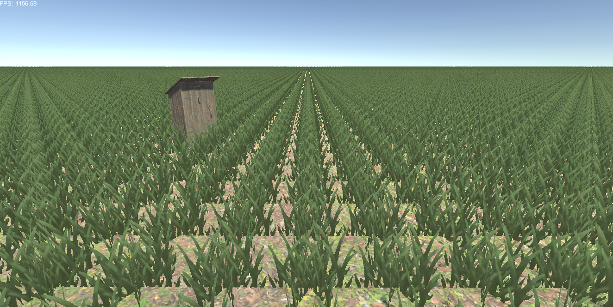
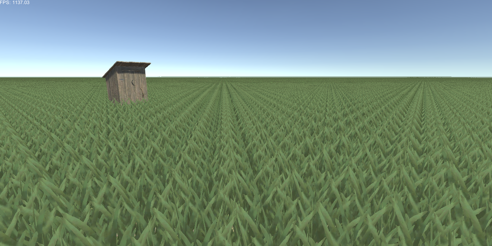
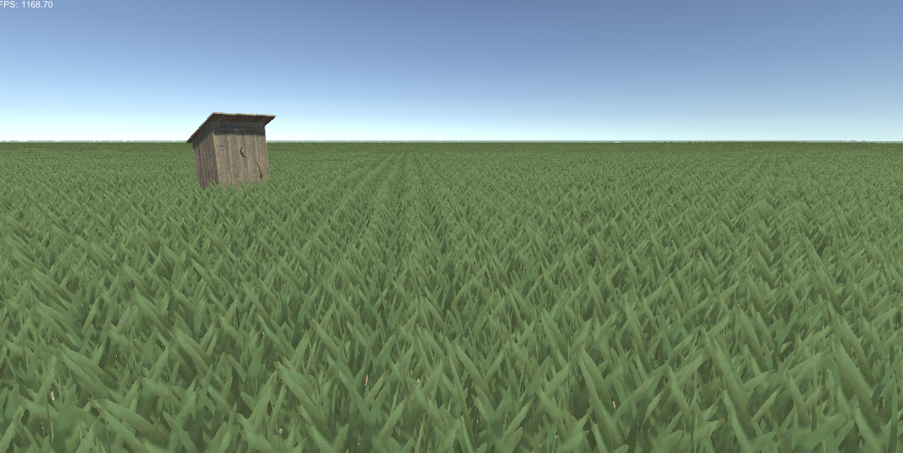
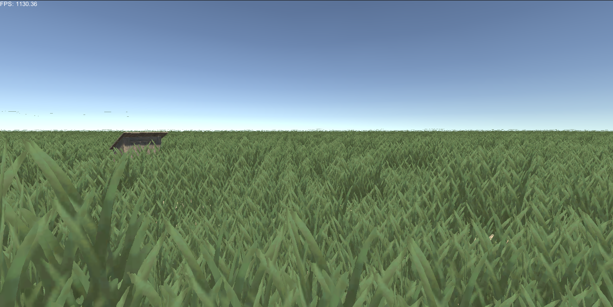

# Grass

This is a repo I am using to learn different ways to render grass. This first variant uses billboarding, next will be using an actuall 3d model. 


## Steps taken

### 211,600 grass rendered(2,539,200 vertices)



### 423,200 grass rendered(5,078,400 vertices)



### Randomized the grass position



### Grass with position and height variance



### Animated artificial wind


 
- 2 triangles that form a quad of grass, technique known as billboarding

- Use 3 intersecting quads

- Create grass texture

- Use GPU Instancing
  - Create massive buffer of grass positions
  - Then ask GPU to use buffer to find propery grass position each frame

- Calculate grass positions using the compute shader so that the positions of the grass will go directly into the GPU buffer

- The positions we are creating will fill a square space of whatever size we like

- We take thread id of our compute shader thread, 
  - `position = id.xy`
  - Which will in range of `0 <= id.xy <= 300`
  - Then we subtract 150 `position = id.xy - 150` so that it centers it over the origin

- There should now be one grass object every meter

- Lets double amount of grass objects
  - Multiply `position *= (1 / Density)` (Density being 2)

- Added some variants to the grass positions
  - `pos.xz += noise()`

- Added some variants to the height of the grass with simplex noise
  - So that height variants are clumped together
  - `pos.y *= noise()`

- Wind
  - We hash the instance id of the grass object to get random unique to individual object
  - Then 
  ```
  if id_hash > threashold:
    fast_cos
  else:
    slow_cos
  ```
  - Otherwise we compute different cos value with parameterized frequency
  ```
  cos(t * _Frequency)
  ```
  - This frequency is reduced on grass that is taller since takes longer to swing back and forth
  ```
  cos(t * (_Frequency - GrassHeight))
  ```
  - Next we square the cosine wave, reduce its amplitude, then subtract from it based on id hash to add local variance to the cosine value, and then reduce amplitude even further
  ```
  (cos * cos * 0.65) - id_hash * 0.5
  ```
  - Finally we add this trigvalue to the local position of our top side vertices, scaled by hash id for further localized variants and also height variance of the grass, since taller grass sways further than shorter grass
  ```
  pos.xz += uv.y * trigValue * grassHeight * id_hash * 0.6
  ```
